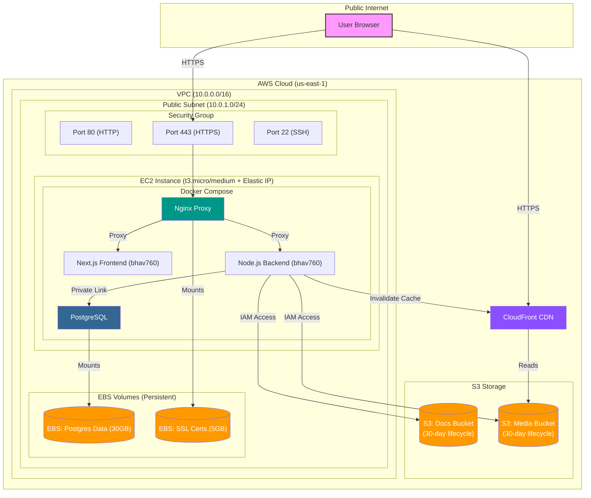

# 🏗️ Deployment Architecture: Real Estate Platform

This document describes the "Production-Ready" architecture of your application deployed on AWS `us-east-1`.

## 📊 High-Level Diagram

---

## 🔒 1. Networking & Security
*   **Elastic IP (Permanent IP)**: The EC2 instance is assigned a static, permanent public IP address. This ensures the IP does not change if the server is stopped or restarted, keeping DNS records stable.
*   **VPC Isolation**: The entire infrastructure sits inside a Virtual Private Cloud (VPC), ensuring no outside access except through defined gateways.
*   **Security Group**: Acts as a virtual firewall.
    *   **Port 80**: Redirects all traffic to HTTPS.
    *   **Port 443**: Main entry point for encrypted user traffic.
    *   **Port 22**: Restricted access for management via SSH.

## 🐳 2. Container Orchestration (Docker Compose)
*   **Images & Registry**: The Frontend and Backend images are built via docker compose and stored in the custom Docker Hub registry (`bhav760`).
*   **Dual Network Isolation**:
    *   **`frontend-network`**: Connects Nginx, Frontend, and Backend. This is the only network that receives external traffic.
    *   **`backend-network`**: A private network connecting only the Backend and Postgres. **The Database is not exposed to the frontend or the internet.**
*   **Service Discovery**: Containers communicate using service names (e.g., `http://backend:5000`) instead of IP addresses, making the system resilient to container restarts.

## 💾 3. Data Persistence (EBS Volumes)
*   **Decoupled Storage**: Your database data is stored on **Elastic Block Store (EBS)** volumes, not inside the containers or the EC2 root disk.
*   **Reliability**: If the EC2 instance fails, you can simply attach these EBS volumes to a new instance, and your data (Database & SSL) will be perfectly intact.
*   **Mount Points**:
    *   `/mnt/ebs/postgres/data` → Mounted to Postgres container for durability.
    *   `/mnt/ebs/certs` → Mounted to Nginx container for SSL certificates.

## ☁️ 4. Cloud Storage & CDN (S3 + CloudFront)
*   **Media & Docs Storage**: Property images and documents are stored securely in two dedicated **AWS S3 Buckets** instead of local disk.
*   **Automated Cleanup (Lifecycle)**: Both buckets have a **30-day lifecycle policy** configured, automatically expiring and deleting old files to keep storage costs low and predictable.
*   **Content Delivery Network (CDN)**: **AWS CloudFront** caches and serves the media files globally from the S3 bucket, significantly reducing bandwidth load on the EC2 instance and speeding up delivery.
*   **IAM Least Privilege**: The Backend securely communicates with S3 and CloudFront using a dedicated IAM user whose access is strictly scoped to these specific resources.

## 🛡️ 5. SSL & Proxying
*   **SSL Termination**: Nginx handles the encryption/decryption. The internal traffic between containers is fast and unencrypted.
*   **Next.js Frontend**: Serves the UI and performs Server-Side Rendering (SSR) by communicating with the Backend internally.
*   **Node.js Backend**: Handles business logic, interactions with AWS, and secure database transactions.

---

## 🚀 Future Scalability Suggestions
1.  **RDS Upgrade**: Eventually move the `Postgres` container to **AWS RDS** for managed backups and multi-AZ high availability.
2.  **Application Load Balancer (ALB)**: Replace Nginx with an **AWS ALB** to handle SSL and distribute traffic across multiple EC2 instances.
